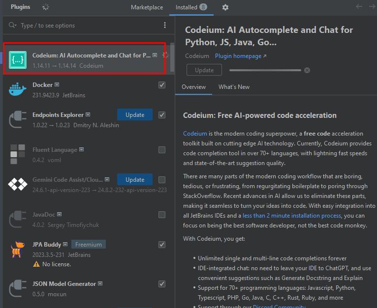

# Java Standard

## What is Javadocs?

Javadocs is a standard for documenting Java code.

## What is purpose of Javadocs?

### Points of concern
- **Enhances code comprehension**: New developers will find it easier to understand your code.
- **Accelerates development**: Developers can quickly locate necessary methods and understand how to use them.
- **Facilitates code maintenance**: Code changes can be well-documented.
- **Improves code quality**: The process of writing JavaDoc will force you to think more clearly about your code design.

### benefit implement javadocs
- Well-written JavaDoc enhances code comprehension for both new and experienced developers.
- By using clear and concise JavaDoc, you can accelerate development and reduce debugging time.
- Facilitating code maintenance is a key benefit of writing comprehensive JavaDoc.
- The process of writing JavaDoc can improve code quality by encouraging you to think more critically about your design decisions.

## AIT Standard for Javadocs

### Upper Class
In upper class, you need to write Javadoc as the example below:

```java
    /**
     * This class is used to do something.
     * 
     * @author {developer_name} / Akarinti Technology
     */
    
    public class AIT{
      
    }
```

The following are the upper classes that require JavaDoc:
- Entity
- Controller
- Service
- Configuration

### Function / Method

Each method you create should be accompanied by Javadoc. If you're writing an interface, be sure to include Javadoc for each method. If you're writing an implementation of that interface, you don't need to include Javadoc for the method unless you want to add additional information. Private methods should also include Javadoc.

example in interfaces:
```java
/**
 * This interface is for manipulating data on database JiraReport and process from database Jira Report
 * @author Bintang / Akarinti Technology
 */
public interface JiraReportCommandAdapter {

      /**
       * Save the given JiraStoryMaster to the database.
       * <p>
       * This function is transactional, so if any error occurs during the execution of this function,
       * all the operations will be rolled back.
       * <p>
       * This function should be used to save a JiraStoryMaster object that has been created or
       * modified.
       *
       * @param jiraStoryMaster the JiraStoryMaster to save
       */
      void saveStoryMaster(JiraStoryMaster jiraStoryMaster);
      /**
       * Save the given JiraReport to the database.
       * <p>
       * This function is transactional, so if any error occurs during the execution of this function,
       * all the operations will be rolled back.
       * <p>
       * This function should be used to save a JiraReport object that has been created or
       * modified.
       *
       * @param jiraReport the JiraReport to save
       */
      void saveJiraReport(JiraReport jiraReport);
  }
```
## Tricks for Writing Javadoc Effectively

 you can use plugin on your IDE for helping you to create java doc example: codeium ai

## Example to use Codeium AI for create Javadocs 

you should install codeium ai on your IDE:



### Video example
